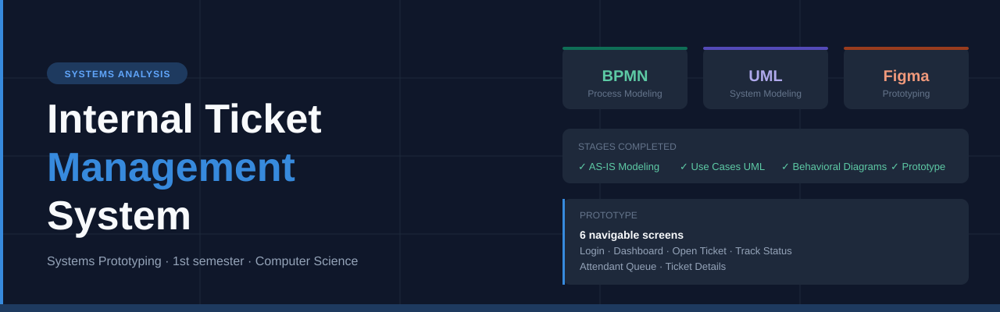
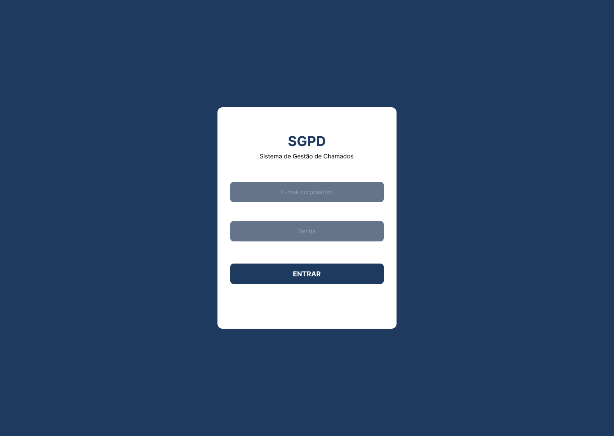
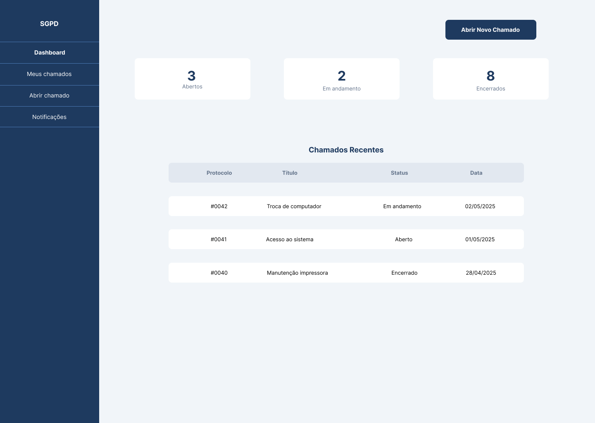
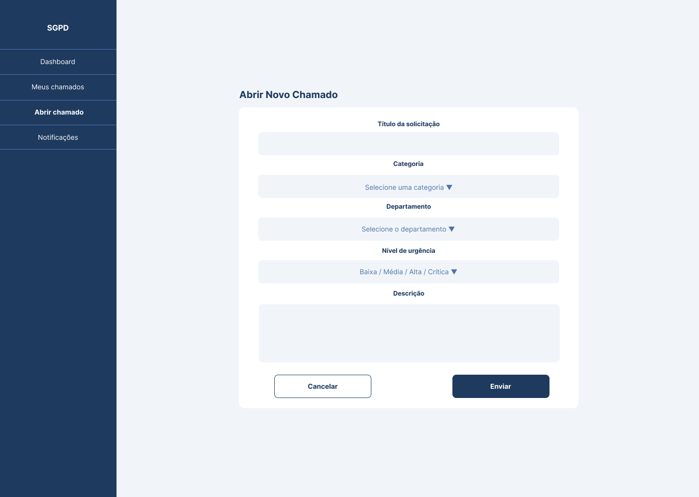
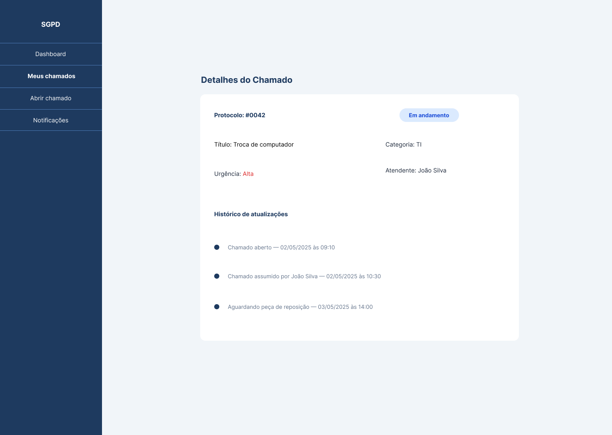
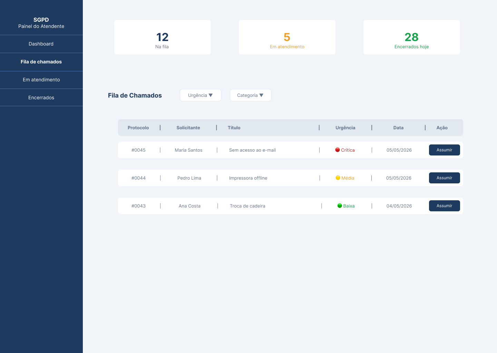
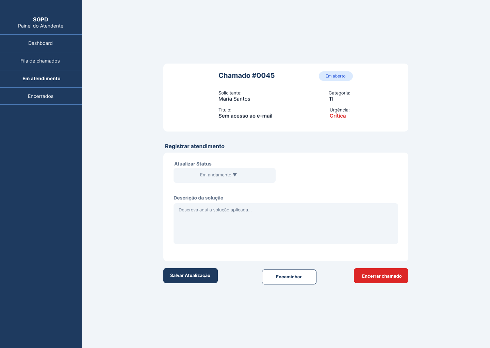

# Internal Ticket Management System

> Project developed in the **Systems Prototyping** course — 1st semester of Computer Science.


---

## 📌 About

This project simulates the work of a Systems Analyst at a fictional technology company — **TechCorp Solutions**. The goal was to analyze a real organizational problem, propose a digital solution, model the entire system architecture using BPMN and UML, and build a navigable prototype validated with users.

---

## ⚠️ Problem

The organization managed internal requests through a manual and decentralized process — emails, WhatsApp messages, and verbal communication. This caused:

- No demand control or traceability
- Information loss and rework
- Service delays
- Strategic stakeholders with no process visibility

---

## 🗺️ Project Progress

| Stage | Description | Status |
|-------|-------------|--------|
| I | Process Analysis and BPMN Modeling (AS-IS) | ✅ Done |
| II | UML Modeling — Use Cases and Textual Specification | ✅ Done |
| III | UML Modeling — Classes, Sequence and Activity Diagrams | ✅ Done |
| IV | Functional Prototype and Usability Validation | ✅ Done |

---

## ✅ Stage I — AS-IS Process Modeling (BPMN)

Current process modeled using **BPMN** with 6 swim lanes, highlighting operational failures such as no integrated system, informal communication, and strategic stakeholders with no visibility.

### Identified Stakeholders

| Stakeholder | Role | Influence |
|-------------|------|-----------|
| Employee | End user — opens requests | Medium |
| Support / IT Team | Handles and manages tickets | High |
| Department Manager | Supervises and approves tickets | High |
| System Administrator | Manages users and settings | High |
| Board / Directors | Strategic decision-making | Very High |
| HR / Quality | Performance analysis and improvement | Medium |

### BPMN Diagram — AS-IS Process


---

## ✅ Stage II — UML Modeling: Use Cases

**UML Use Case Diagram** representing the proposed digital system with 6 actors and 20 use cases, followed by detailed textual specification.

### Use Case Diagram


### Textual Specification

| | UC1 — Open Request | UC2 — Take Ownership |
|--|-------------------|---------------------|
| **Primary actor** | Employee | Support / IT Team |
| **Pre-condition** | User authenticated | Attendant authenticated, ticket in queue |
| **Main flow** | Fill form → validate → generate protocol → notify | Take ticket → execute → record solution → close |
| **Post-condition** | Ticket registered with unique protocol | Ticket assigned, history recorded, employee notified |

---

## ✅ Stage III — UML Modeling: Behavioral Diagrams

### Identified Classes

| Class | Responsibility |
|-------|---------------|
| `Collaborator` | Opens and tracks tickets |
| `Ticket` | Core entity — stores data and generates protocol |
| `Attendant` | Takes ownership, updates and resolves tickets |
| `Notification` | Triggers automatic status alerts |
| `Category` | Defines ticket type and SLA |
| `ActivityLog` | Records all actions for audit trail |

### Sequence Diagram — UC1


### Activity Diagram — UC1


### Model Integration

> The class diagram defines structure — available attributes and methods. The sequence diagram shows how those methods are invoked between objects over time. The activity diagram represents the same flow from a business rules perspective. All three models are complementary and consistent with each other.

---

## ✅ Stage IV — Functional Prototype and Usability Validation

Navigable low/medium fidelity prototype built in **Figma**, validated through a simulated usability test using the Think Aloud protocol.

### 🔗 Access the Prototype

> **[Open navigable prototype on Figma](https://www.figma.com/design/rjYi4jycqJjVOmnE57NvBc/SGPD---Sistema-de-Gest%C3%A3o-de-Chamados?node-id=0-1&t=Ptrnx2zOLsSoX5iu-1)**

### Prototype Screens

| Screen | Description |
|--------|-------------|
| 01 — Login | Authentication with corporate email and password |
| 02 — Employee Dashboard | Overview of open, in-progress and closed tickets |
| 03 — Open New Ticket | Form with title, category, description and urgency |
| 04 — Track Ticket Status | Ticket details with update timeline |
| 05 — Attendant Dashboard | Ticket queue with priority filters |
| 06 — Ticket Details & Service | Take ownership, update status and record solution |

### Screen Previews













### Usability Validation

**Test persona:** Patrícia Oliveira Mendes, 28, HR Assistant — intermediate tech familiarity, first contact with a ticket management system.

**Tasks evaluated:**
1. Register a new internal request
2. Check the status of an existing ticket
3. Take ownership of a ticket as an attendant

**Key findings:**
- ✅ "Open new ticket" button found quickly — clear positioning
- ✅ Attendant queue was considered organized and easy to scan
- ⚠️ Category field caused hesitation — options needed clearer descriptions
- ⚠️ Users expected a dedicated "My Tickets" tab instead of clicking from the dashboard

**Proposed improvements:**
1. Add short descriptions to each category option in the dropdown
2. Add a "My Tickets" tab in the sidebar with a "View details" button on each ticket card
3. Add tooltips to status options explaining the difference between "In progress" and "Waiting"

---

## ⚙️ System Requirements

### Functional
- Ticket registration with automatic protocol
- Real-time status tracking
- Automatic prioritization by urgency
- Assignee management and history logging
- Automatic notifications
- Reports and management KPIs

### Non-Functional
- Performance (response < 2 seconds)
- Security and access control
- Intuitive usability
- Minimum 99% availability
- Scalability

---

## 📁 Repository Structure

```
internal-ticket-system/
├── docs/
│   ├── diagrams/
│   │   ├── bpmn_as_is.svg
│   │   ├── bpmn_as_is.png
│   │   ├── use_case_diagram.svg
│   │   ├── sequence_diagram_uc1.svg
│   │   └── activity_diagram_uc1.svg
│   └── prototype/
│       ├── 01-login.png
│       ├── 02-employee-dashboard.png
│       ├── 03-open-ticket.png
│       ├── 04-track-status.png
│       ├── 05-attendant-dashboard.png
│       └── 06-ticket-details.png
├── banner.svg
└── README.md
```

---

## 📚 Key Learnings

- Requirements gathering and stakeholder analysis
- Process modeling with BPMN
- UML modeling: Use Cases, Classes, Sequence and Activity diagrams
- Textual use case specification with exception flows
- Interface prototyping with Figma
- Usability testing and iterative improvement
- Systematic thinking before coding

---

👨‍💻 **Author:** Tales Manfredine Ferreira Lopes — Computer Science Student
