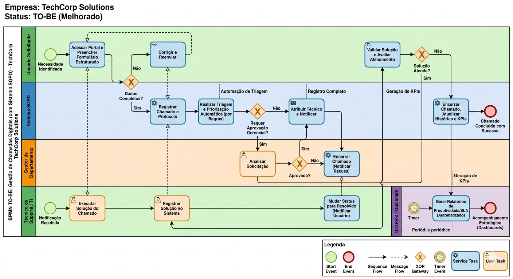
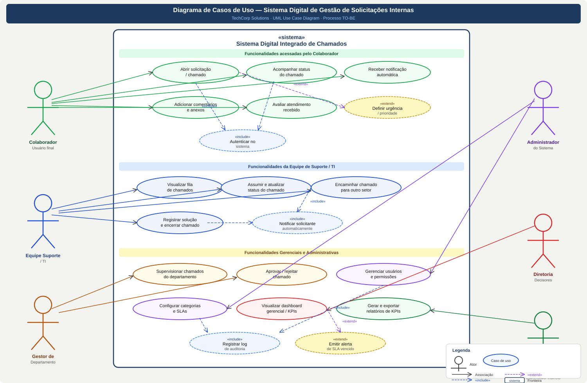
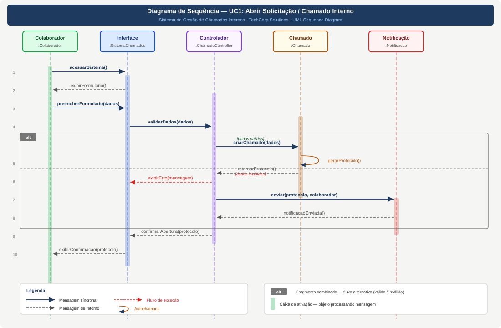
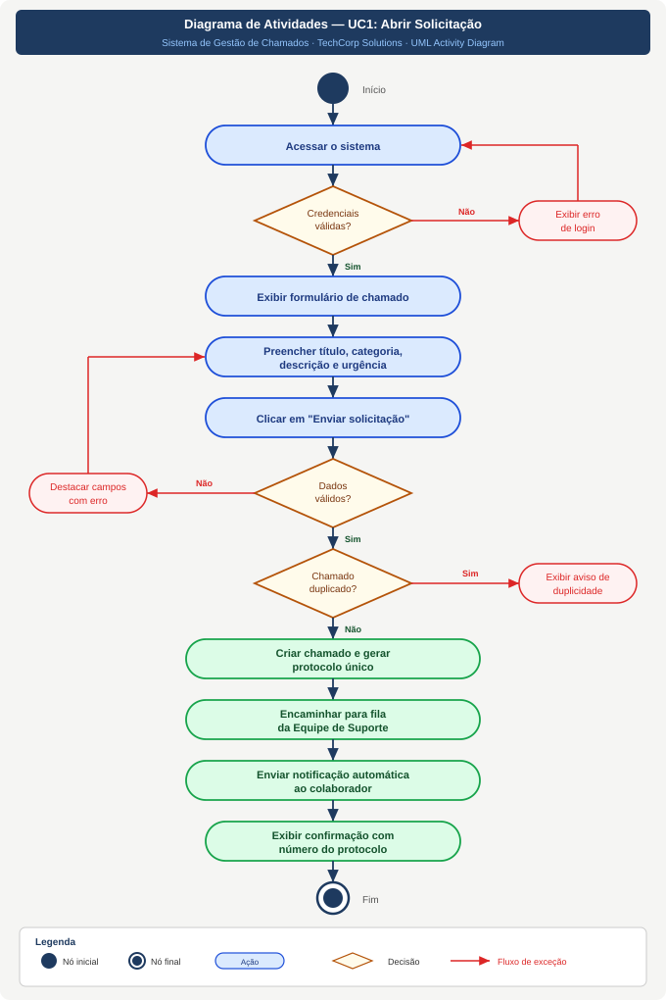

# 📊 Sistema de Gestão de Chamados Internos | Internal Ticket Management System

> 🇧🇷 Projeto desenvolvido na disciplina de **Prototipagem de Sistemas** — 1º semestre de Ciência da Computação.
> 🇺🇸 Project developed in the **Systems Prototyping** course — 1st semester of Computer Science.

---

## 🗺️ Progresso do Projeto | Project Progress

| Etapa | Descrição | Status |
|-------|-----------|--------|
| I | Análise do Processo e Modelagem BPMN (AS-IS) | ✅ Concluída |
| II | Modelagem UML — Casos de Uso e Especificação Textual | ✅ Concluída |
| III | Modelagem UML — Sequência, Atividades e Interpretação | ✅ Concluída |
| IV | Síntese, Reflexão e Entrega Final | 🔄 Em breve |

---

# 🇧🇷 Português

## 📌 Sobre o Projeto

Este projeto simula o trabalho de um Analista de Sistemas em uma empresa fictícia de tecnologia. O objetivo foi analisar um processo organizacional com problemas reais, propor uma solução digital e modelar toda a arquitetura do sistema utilizando notações BPMN e UML.

---

## ⚠️ Problema Identificado

A organização analisada utilizava um processo manual e descentralizado para gerenciar solicitações internas, usando e-mails, mensagens e comunicação verbal. Isso gerava:

- Falta de controle das demandas
- Perda de informações e retrabalho
- Atrasos no atendimento
- Baixa rastreabilidade
- Stakeholders estratégicos sem visibilidade do processo

---

## ✅ Etapa I — Modelagem do Processo Atual (AS-IS)

Modelagem do processo atual utilizando **BPMN** com 6 raias representando cada stakeholder, evidenciando as falhas operacionais.

### 👥 Stakeholders identificados

| Stakeholder | Papel | Influência |
|-------------|-------|------------|
| Colaborador | Usuário final — abre solicitações | Média |
| Equipe Suporte / TI | Atende e gerencia os chamados | Alta |
| Gestor de Departamento | Supervisiona e aprova chamados | Alta |
| Administrador do Sistema | Gerencia usuários e configurações | Alta |
| Diretoria | Tomada de decisões estratégicas | Muito Alta |
| RH / Qualidade | Análise de desempenho e melhoria contínua | Média |

### 📊 Diagrama BPMN — Processo AS-IS



---

## ✅ Etapa II — Modelagem UML: Casos de Uso e Especificação Textual

Desenvolvimento do **Diagrama de Casos de Uso UML** representando o sistema proposto, com especificação textual detalhada dos principais casos de uso.

### 🧩 Diagrama de Casos de Uso



### 📋 Casos de Uso principais

- Abrir solicitação / chamado interno
- Acompanhar status em tempo real
- Assumir e atualizar status do chamado
- Encaminhar chamado para outro setor
- Aprovar / rejeitar chamado
- Visualizar dashboard gerencial / KPIs
- Gerar e exportar relatórios
- Gerenciar usuários e permissões
- Configurar categorias e SLAs
- Registrar log de auditoria *(«include»)*
- Emitir alerta de SLA vencido *(«extend»)*

### 📝 Especificação Textual

| | UC1 — Abrir Solicitação | UC2 — Assumir Chamado |
|--|------------------------|----------------------|
| **Ator principal** | Colaborador | Equipe Suporte / TI |
| **Pré-condição** | Usuário autenticado | Atendente autenticado e chamado na fila |
| **Pós-condição** | Chamado registrado com protocolo único | Chamado atribuído e colaborador notificado |

---

## ✅ Etapa III — Modelagem UML: Diagramas Comportamentais

Modelagem estrutural e dinâmica do sistema com diagramas de classes, sequência e atividades.

### 🏗️ Classes identificadas

| Classe | Responsabilidade |
|--------|-----------------|
| `Colaborador` | Abre e acompanha chamados |
| `Chamado` | Entidade central — armazena dados e gera protocolo |
| `Atendente` | Assume, atualiza e resolve chamados |
| `Notificacao` | Dispara alertas automáticos de status |
| `Categoria` | Define tipo e SLA do chamado |
| `HistoricoAtividade` | Registra todas as ações para auditoria |

### 🔄 Diagrama de Sequência — UC1: Abrir Solicitação

Representa a troca de mensagens entre objetos ao longo do tempo, com fragmento combinado `alt` para o fluxo de dados válidos e inválidos.



### 🔀 Diagrama de Atividades — UC1: Abrir Solicitação

Representa o fluxo lógico de negócio com nós de ação, decisões e tratamento de exceções.



### 🔗 Integração entre os modelos

> O diagrama de classes define a estrutura — atributos e métodos disponíveis. O diagrama de sequência mostra como esses métodos são invocados entre objetos ao longo do tempo. O diagrama de atividades representa o mesmo fluxo na perspectiva das regras de negócio. Os três diagramas são complementares e consistentes entre si.

---

## ⚙️ Requisitos do Sistema

### ✅ Funcionais
- Cadastro de chamados com protocolo automático
- Acompanhamento de status em tempo real
- Priorização automática por urgência
- Atribuição de responsáveis
- Registro de histórico completo
- Notificações automáticas
- Relatórios e KPIs gerenciais

### 🔒 Não Funcionais
- Desempenho (resposta < 2 segundos)
- Segurança e controle de acesso
- Usabilidade intuitiva
- Disponibilidade mínima de 99%
- Escalabilidade

---

## 📁 Estrutura do Repositório

```
internal-ticket-system/
├── docs/
│   └── diagrams/
│       ├── bpmn_as_is.svg                # Diagrama BPMN — Processo AS-IS
│       ├── bpmn_as_is.png                # Versão PNG do BPMN
│       ├── use_case_diagram.svg          # Diagrama de Casos de Uso UML
│       ├── sequence_diagram_uc1.svg      # Diagrama de Sequência — UC1
│       └── activity_diagram_uc1.svg      # Diagrama de Atividades — UC1
└── README.md
```

---

## 📚 Aprendizados

- Levantamento e análise de requisitos
- Modelagem de processos com BPMN
- Identificação e classificação de stakeholders
- Modelagem UML: Casos de Uso, Classes, Sequência e Atividades
- Especificação textual com fluxos principal, alternativo e de exceção
- Integração entre modelos estruturais e comportamentais
- Pensamento sistemático antes de codificar

---
---

# 🇺🇸 English

## 📌 About the Project

This project simulates the work of a Systems Analyst at a fictional technology company. The goal was to analyze an organizational process with real problems, propose a digital solution, and model the entire system architecture using BPMN and UML notations.

---

## ⚠️ Problem Identified

The analyzed organization managed internal requests through a manual and decentralized process, relying on emails, messages, and verbal communication. This caused:

- Lack of demand control and information loss
- Rework and service delays
- Low traceability
- Strategic stakeholders with no process visibility

---

## ✅ Stage I — Current Process Modeling (AS-IS)

Current process modeled using **BPMN** with 6 swim lanes representing each stakeholder, highlighting operational failures.

### 📊 BPMN Diagram — AS-IS Process


---

## ✅ Stage II — UML Modeling: Use Cases and Textual Specification

Development of the **UML Use Case Diagram** representing the proposed system, with detailed textual specification of the main use cases.

### 🧩 Use Case Diagram


---

## ✅ Stage III — UML Modeling: Behavioral Diagrams

Structural and dynamic modeling of the system with class, sequence, and activity diagrams.

### 🏗️ Identified Classes

| Class | Responsibility |
|-------|---------------|
| `Collaborator` | Opens and tracks tickets |
| `Ticket` | Core entity — stores data and generates protocol |
| `Attendant` | Takes ownership, updates and resolves tickets |
| `Notification` | Triggers automatic status alerts |
| `Category` | Defines ticket type and SLA |
| `ActivityLog` | Records all actions for audit trail |

### 🔄 Sequence Diagram — UC1: Open Request


### 🔀 Activity Diagram — UC1: Open Request


### 🔗 Model Integration

> The class diagram defines the structure — available attributes and methods. The sequence diagram shows how those methods are invoked between objects over time. The activity diagram represents the same flow from a business rules perspective. All three diagrams are complementary and consistent with each other.

---

## 📁 Repository Structure

```
internal-ticket-system/
├── docs/
│   └── diagrams/
│       ├── bpmn_as_is.svg                # BPMN Diagram — AS-IS Process
│       ├── bpmn_as_is.png                # PNG version of BPMN
│       ├── use_case_diagram.svg          # UML Use Case Diagram
│       ├── sequence_diagram_uc1.svg      # Sequence Diagram — UC1
│       └── activity_diagram_uc1.svg      # Activity Diagram — UC1
└── README.md
```

---

## 📚 Key Learnings

- Requirements gathering and analysis
- Process modeling with BPMN
- Stakeholder identification and classification
- UML modeling: Use Cases, Classes, Sequence and Activity diagrams
- Textual specification with main, alternative and exception flows
- Integration between structural and behavioral models
- Systematic thinking before coding

---

👨‍💻 **Author:** Tales Manfredine Ferreira Lopes — Computer Science Student
